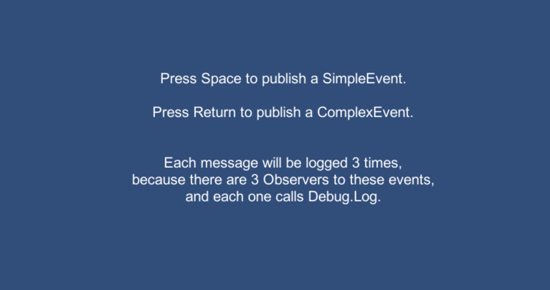
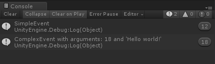

# Events

Use this if you want to do Event-Driven Programming very easily in your project.

## Getting Started

For a quick import into an existing project, just get the [UnityPackage](EventsPackage.unitypackage).

The Events folder is an empty project with only the plugin imported and some examples! :)

See the [Code Usage](#code-usage) for details on how to use it in your project.

## Prerequisites

There are absolutely no prerequisites to this plugin.

Everything comes into a few files (and most of them are used for demo).

## Code Usage

Examples of Events :

    
    public class SimpleEvent : Event
    {
        // You can have an event with no parameter at all.
    }

    public class ComplexEvent : Event
    {
        // Or you can have an event which carries parameters across all observers.

        public int myInt { get; private set; }
        public string myString { get; private set; }

        public ComplexEvent() { }

        public ComplexEvent(int myInt)
        {
            this.myInt = myInt;
        }

        public ComplexEvent(int myInt, string myString)
        {
            this.myInt = myInt;
            this.myString = myString;
        }
    }

Example of a Publisher :

    
    public class ExamplePublisher : MonoBehaviour
    {

        void Update()
        {
            if (Input.GetKeyDown(KeyCode.Space))
            {
                // Any class can publish any event by calling this.Publish.
                this.Publish<SimpleEvent>();
            }

            if (Input.GetKeyDown(KeyCode.Return))
            {
                // Here is how you can publish an event with parameters.
                this.Publish(new ComplexEvent(18, "Hello world!"));
            }
        }
    }

Example of an Observer :

    
    public class ExampleObserver : MonoBehaviour,
    IEventHandler<SimpleEvent>,
    IEventHandler<ComplexEvent> // You can handle as many events as you want!
    {

        // We can subscribe in Awake, to be able to respond to events that are published in Start.
        // Note that you won't be able to catch events that have been published before you subscribed!
        void Awake()
        {
            // This is how you suscribe to an event.
            this.Subscribe<SimpleEvent>();
            // I don't know why it is not recognized by VS for autocompletion, though
            this.Subscribe<ComplexEvent>();
        }

        void IEventHandler<SimpleEvent>.Handle(SimpleEvent @event) // This is a possible writing of the method
        {
            Debug.Log("SimpleEvent");
        }

        public void Handle(ComplexEvent @event) // This is another possible writing of the method. You decide!
        {
            Debug.Log("ComplexEvent with arguments: " + @event.myInt + " and '" + @event.myString + "'");
        }

        void Destroy()
        {
            // It is recommended to unsuscribe to the events you were subscribed to,
            // when you're not able to catch them anymore.
            this.Unsubscribe<SimpleEvent>();
            this.Unsubscribe<ComplexEvent>();
        }
    }

## Screenshots

## Notes

* Last tested with [Unity 2018.2.1f1](https://unity3d.com/unity/whatsnew/unity-2018.2.1).

## Authors

* **[Arthur Cousseau](https://www.linkedin.com/in/arthurcousseau/)**

## License

This project is licensed under the MIT License - see the [LICENSE.md](LICENSE.md) file for details
